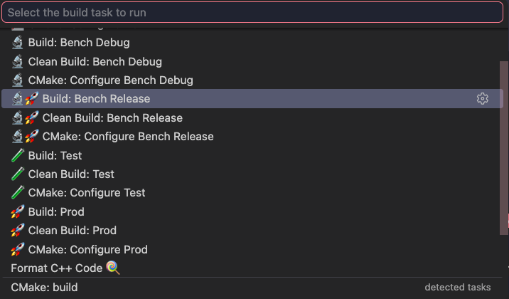
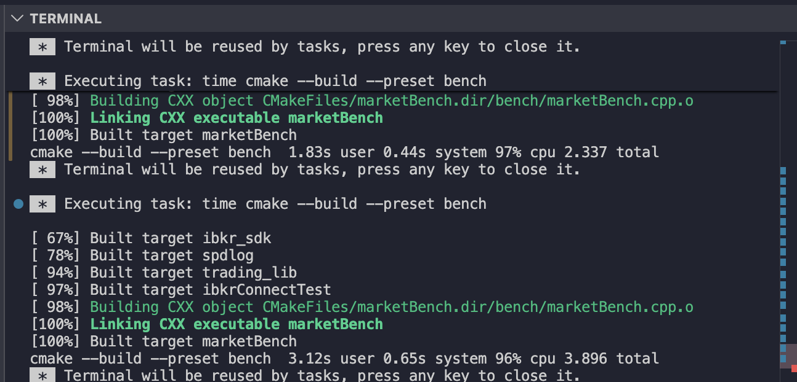
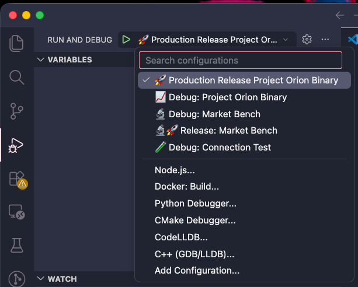

# Benchmarks

Microbenchmarks for hot-path components in the ingestion and transform pipelines. Run via the `bench-release` CMake preset for representative numbers (debug info stripped) and `bench-debug` for testing bench code.

```bash
cmake --preset bench-release
cmake --build --preset bench-release --parallel
./build_bench_release/benchmark/<binary>
```

**Or via VSCode:** press `Ctrl+Shift+B` (`Cmd+Shift+B` on macOS) to run the configured build task
directly, no terminal needed.



*Select the `bench-release` build task from the picker.*



*Build output appears in the integrated terminal panel. Also includes compile time at: <br>
`cmake --build --preset bench _ user _ system _ cpu _ total`*



*Select `Production Release` and click the green play button to run.*

## Dev Environment

| | Env Settings | Commands |
|---|---|---|
| Hardware | Apple M2 <br> 8 cores (8 physical / 8 logical)  | `sysctl -n machdep.cpu.brand_string`<br>`sysctl -n hw.ncpu`<br>`sysctl -n hw.physicalcpu` |
| OS | ProductName:		macOS <br> ProductVersion:		26.5.1 <br> BuildVersion:		25F80 <br>| `sw_vers` |
| Compiler |  Apple Clang 15.0.0 (clang-1500.3.9.4)<br> arm64-apple-darwin25.5.0 | `clang --version` |

**Note:** numbers below were captured on a personal dev machine without CPU affinity/thread
pinning. Next Step: Produce production-realistic numbers with a dedicated or pinned environment

## Market Bench

To stress test my market ingestion, I wanted to simulate different load modes that test edge cases of how data can arrive to our system. With a general idea that instrument data can range in different loads arrivals, I made the design be able to withstand what I believe is the worst case scenario, 100K ticks/sec per stock. This results in making my design decison of the tick data SPSC buffer size be `80,000` or `kNumInstruments × 10,000` . My design decision for the quote snapshot SPSC buffer size is `32`, because we uniformally get our quote snapshot every 250ms, meaning we only get 4 quote snapshots/sec per instrument. Therefore: `kNumInstruments × 4 = 32`

Three load modes are available in `marketBench.cpp`:

| Mode | Description |
|---|---|
| `UNIFORM` | Constant 100K ticks/sec/instrument, no bursting — steady pacing throughout |
| `BURST_MIXED` | Alternates 10,000 burst rounds and 10,000 quiet rounds. Burst rounds run at 4x the average baseline rate (5 burst windows/sec at ~25ms, quiet windows ~175ms), averaging to the target rate 100K ticks/sec/instrument. **This is the mode used for both scenarios below.** |
| `PURE_BURST` | No rate limiting, ticks sent as fast as possible. Used briefly to test raw SPSC queue push/pop capacity in isolation as it completes too quickly to run any 15-second bar-flush path. |

Scenarios below were both run under `BURST_MIXED`, with the underlying per-instrument rate
constant (`wakeAt` pacing) changed between them:

- **Scenario A**: pacing applied per-instrument-tick before a bug fix, resulting in a rate that
  was actually 100K/sec *combined* across all 8 instruments (~12.5K/instrument).
- **Scenario B**: pacing fixed to apply once per round (all 8 instruments sent back-to-back,
  then a single wait) — rate constants now correctly represent 100K/sec **per instrument**
  (~800K/sec combined).

### Scenario A — 100K ticks/sec combined (~12.5K/instrument)

| | |
|---|---|
| Date measured | July 16, 2026 |
| Hardware/OS/Compiler | see Environment above (unchanged) |
| Background load | Mixed — multiple runs with varying background OS load (heavier processes and browser helper processes present in early runs, closed in later runs within this scenario) |

| Metric | p50 | p99 | Notes |
|---|---|---|---|
| Tick → processed latency | 167 ns | 541 ns – 35 µs | wide p99 range driven by background OS load; consistently tight (<1 µs) once background processes were controlled |
| Sustained throughput | 91,600–99,738 ticks/sec combined | | zero packet loss at buffer depth ≥ 10,000 |
| Flush time (per 15s bar-build call) | ~12.7–35.7 ms avg | up to 171 ms (one run, outlier flush spike) | quartile sort enabled; lower volume at this rate keeps sort cost small |
| Minimum reliable SPSC buffer depth | 10,000 | | validated across 8+ runs, both noisy and clean environments |

### Scenario B — ~790–800K ticks/sec combined (100K/instrument)

| | |
|---|---|
| Date measured | [date — fill in] |
| Hardware/OS/Compiler | see Environment above (unchanged) |
| Background load | More controlled — heavy processes killed, browser helper processes closed prior to measurement, but didn't pin cpu or real-time kernel tuning so can be improved on  |

| Metric | p50 | p99 | Notes |
|---|---|---|---|
| Tick → processed latency | 250–333 ns | 2.4–31.6 µs | queue dequeue through full `onTradeTick()` processing (Welford stats, OHLC update) |
| Quote → processed latency | ~15 µs | 19–39 µs | lower volume (32 quotes/sec observed); one run showed p99 spike to 384 µs, not yet root-caused |
| Sustained throughput | 785–794K ticks/sec combined | | zero packet loss at buffer depth ≥ 80,000 |
| Flush time (per 15s bar-build call) | ~176 ms avg | up to 256 ms | quartile sort enabled during these runs — see Known Bottlenecks|
| Minimum reliable SPSC buffer depth | 80,000 | | 70,000 was inconsistent (0–15,636 drops across runs); smaller sizes dropped thousands–tens of thousands |

## Transform layer
⚒️ In progress — `RollingEstimator<Window, NumFactors>` scaffolding exists; regression math not
yet implemented. `strategy.cpp` currently empty.

| Metric | p50 | p99 | Notes |
|---|---|---|---|
| Rolling OLS update (per bar) | — | — | not yet implemented |
| Residualization (per bar) | — | — | not yet implemented |

## Design rationale

- **SPSC queue depth**: empirically determined via burst-load testing, and scales with target
  throughput — 10,000 tick buffer size is sufficient at 100K ticks/sec combined (Scenario A); 80,000 tick buffere size is required at ~800K ticks/sec combined / 100K per instrument (Scenario B). Increasing per-instrument rate will require re-validating these numbers (see Known Bottlenecks).
- **Double-buffer swap (`activeBucket_`/`flushBucket_`)**: O(1) lock-free handoff isolating the
  engine writer thread from the flush reader thread, avoids race conditions and lock contention on the hot path.
- **rigtorp::SPSCQueue as transport layer**: lock-free and wait-free single-producer/single-consumer queue/ ring buffer between the IBKR callback (producer)thread and the engine (consumer)thread. Used to avoid mutex acquisition cost on every tick, avoids false sharing via cache-line padding on the read/write indices, and bounded/ fixed capacity at the start to prevent dynamic growth.
- **Welford's online algorithm for mean/variance**: O(1) per-tick update with no heap allocation, avoids storing raw samples for these two statistics.

## Known bottlenecks / tradeoffs

- **Quartile (Q1/Q2/Q3) computation** in `MarketBucket::build()` currently copies and`std::sort()` the full raw price/size sample vectors (up to ~1.5M+ elements/instrument/bucket
  at 100K ticks/sec/instrument) — measured at 71–256ms(~176 ms avg) per flush call when enabled at this
  volume compared to when `std::sort` was commented out at ~22.6ms avg. 
- **No CPU thread pinning** — tail latency (p99/max) is sensitive to OS scheduling noise on the
  current dev machine. Not yet implemented for macOS dev environment; planned for Linux
  deployment target.